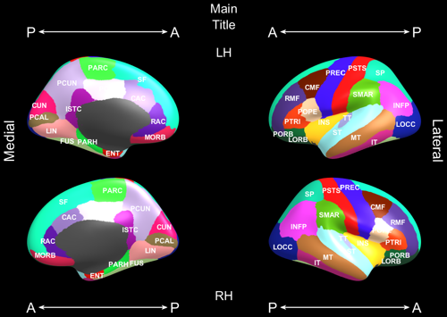

 
{: .content}

These options are name/value pairs that can be used in all plot types.

* 'MainTitle', (string): title to be placed at the top-middle of the plot
* 'MedialLateralLabels', (logical): whether to place 'Medial' and 'Lateral' on the left and right of the figure, respectively
* The following options apply to the text annotation of highlighted regions; requires `FreesurferSeedType` to be either 'aparc' or 'dkt'
** 'UseShortLabels', (logical): whether to use abbreviated labels located on top of the regions rather than use boxes and arrows. Additionally, if 'UseShortLabels' is true, a list of regions highlighted will be printed with their full names in the command window.
** 'NoLabels', (logical): if this is true, no label annotations will be present, false by default
** 'SurfType', (string): Surface type to use, 'inflated' for the inflated surface, 'white' for the white matter surface, 'pial' for the pial surface. 'inflated' is the default and the only one that will be annotated.

# Examples of long and short labels

`freesurfer_statsurf_fsrgb([], 'dkt', 'UseShortLabels', false, 'MedialLateralLabels', true, 'MainTitle', 'Main Title');`

`freesurfer_statsurf_fsrgb([], 'dkt', 'UseShortLabels', true, 'MedialLateralLabels', true, 'MainTitle', 'Main Title');`

The following will have been printed in the command window:

CAC: Caudal anterior cingulate, CMF: Caudal middle frontal, CUN: Cuneus, ENT: Entorhinal, FUS: Fusiform, INFP: Inferior parietal, INS: Insula, ISTC: Isthmus cingulate, IT: Inferior temporal, LIN: Lingual, LOCC: Lateral occipital, LORB: Lateral orbito-frontal, MORB: Medial orbito-frontal, MT: Middle temporal, PARC: Paracentral lobule, PARH: Parahippocampal, PC: Posterior cingulate, PCAL: Pericalcarine, PCUN: Precuneus, POPE: Pars opercularis, PORB: Pars orbitalis, PREC: Precentral, PSTS: Postcentral, PTRI: Pars triangularis, RAC: Rostral anterior cingulate, RMF: Rostral middle frontal, SF: Superior frontal, SMAR: Supramarginal, SP: Superior parietal, ST: Superior temporal, TT: Transverse temporal

Which can be easily copy and pasted into a document as a caption.