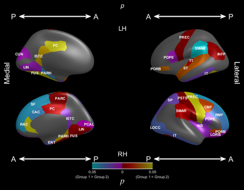
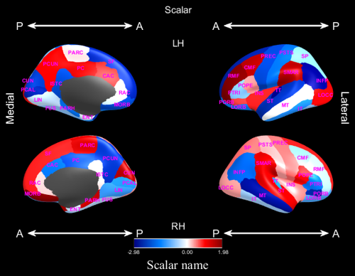
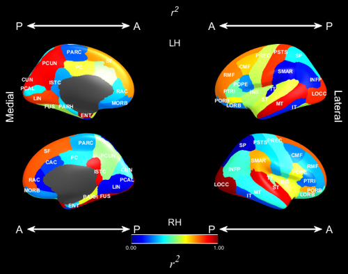
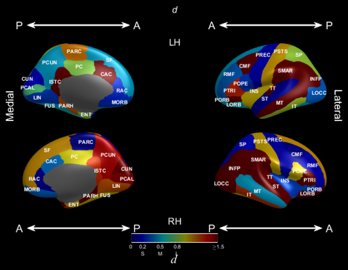

 
{: .content}

# Using

The following functions can be called to create a specific display type:

* *p*-values: `freesurfer_statsurf_p(PValues, TValues, FreesurferSeedType, NAME/VALUE OPTIONS ...)`
* Scalars: `freesurfer_statsurf_scalar(Values, ValuesMask, FreesurferSeedType, NAME/VALUE OPTIONS ...)`
* R squared: `freesurfer_statsurf_rsq(RSQ, RSQMask, FreesurferSeedType, NAME/VALUE OPTIONS ...)`
* Effect sizes: `freesurfer_statsurf_effectsize(EffectSizes, EffectSizesMask, FreesurferSeedType, NAME/VALUE OPTIONS ...)`
* Freesurfer colours: `freesurfer_statsurf_fsrgb(RegionMask, FreesurferSeedType, NAME/VALUE OPTIONS ...)`

The arguments `PValues, TValues, Values, ValuesMask, RSQ, RSQMask, RegionMask, EffectSizes, EffectSizesMask` must be two-element cell arrays with element 1 contains the left hemisphere values  and element 2 containing right hemisphere values. Each cell array element must be a vector of size corresponding to the number of labels in the parcellation scheme chosen in FreesurferSeedType. The parcellation schemes supported are as follows:

* 'aparc': Desikan-Killiany, 34 elements per hemisphere, lable names in seedtype_aparc.txt
* 'dkt': Desikan-Killiany-Tourville, 31 elements per hemisphere, lable names in seedtype_dkt.txt
* 'aparc.a2009s': Destreiux, 75 elements per hemisphere, lable names in seedtype_aparc.a2009s.txt

The non-"Mask" arguments `PValues, TValues, Values, RSQ, RegionMask, EffectSizes` contain values for the relevant and may be any numeric type. The "Mask" arguments `ValuesMask, RSQMask, RegionMask, EffectSizesMask` must be of type `logical` such that only elements that are true will be coloured, elements that are false will be grey. Any of the "Mask" arguments can be given as an empty vector `[]` in which case all regions will be displayed.

## NAME/VALUE OPTIONS

[Common name/value options:](commonoptions) There are a number of NAME/VALUE options that are common to all plot types. 

# Detailed synopsis

## P-value display

* `freesurfer_statsurf_p(PValues, TValues, FreesurferSeedType, NAME/VALUE OPTIONS ...)`

The <I>p</I>-value plot is intended to colour statistically significant regions after hypothesis testing. The `PValues` argument contains the <I>p</I>-values for each region. Regions that have p < 0.05 will be coloured, or grey otherwise. The `TValues` contains the values of the test statistic. The sign of the test statistic, based on a 2-group test, values will be used to separate "Group 1 > Group 2" (positive test statistic) and "Group 2 > Group 1" (negative test statistic).

### P-value plot NAME/VALUE arguments

* 'GroupLabels', {'Group 1', 'Group 2'}: labels for the two groups, {'Group 1', 'Group 2'} by default

### Example

~~~matlab
P = cell(1, 2);
T = cell(1, 2);

for z = 1:2
	P{z} = rand(31, 1) * 0.075;
	T{z} = rand(31, 1) * 5 - 3;
end

freesurfer_statsurf_p(P, T, 'dkt')
~~~

## Scalar display

`freesurfer_statsurf_scalar(Values, ValuesMask, FreesurferSeedType, NAME/VALUE OPTIONS ...)`

This plot type displays arbitrary scalars `Values` with negative values being coloured blue, zero is coloured white and positive values are coloured red. 
The variable `ValuesMask` contains logical vectors indicating which regions should be coloured.

### P-value plot NAME/VALUE arguments

* 'ScalarName', (string): the name of the scalar to be displayed, used as a legend labels
* 'ValueLimits', [Low High]: minimum and maximum values to plot, if not given will be set according to `Values`

### Example

~~~matlab
Values = cell(1, 2);
ValuesMask = cell(1, 2);

for z = 1:2
	Values{z} = rand(31, 1) * 5 - 3;
	ValuesMask{z} = true(31, 1);
end

freesurfer_statsurf_scalar(Values, ValuesMask, 'dkt')
~~~

## R squared display

`freesurfer_statsurf_rsq(RSQ, RSQMask, FreesurferSeedType, NAME/VALUE OPTIONS ...)`

This plot displays values with a colour scheme that ranges from 0 to 1, which is suitable for R squared plots. The values are given in the RSQ argument and the mask in RSQMask determines which regions are coloured and which ones are not.

### R squared plot NAME/VALUE arguments

* 'ScalarName', (string): the name of the scalar to be displayed if not r^2, '\itr^2' by default

### Example

~~~matlab
RSQ = cell(1, 2);
RSQMask = cell(1, 2);

for z = 1:2
	RSQ{z} = rand(31, 1);
	RSQMask{z} = true(31, 1);
end

freesurfer_statsurf_rsq(RSQ, RSQMask, 'dkt')
~~~

## Effect size display

This plot is intended to display effect sizes. The main aspect of this plot is that "S", "M" and "L" are placed on the legend to indicate small, medium and large effect size values.

### Effect size plot NAME/VALUE arguments

* 'ScalarName', (string): the name of the effect. Used to annotated the legend. '\itd' by default for Cohen's d.
* 'SmallMediumLargeEffectSize' [3]: SmallMediumLargeEffectSize(1) small, SmallMediumLargeEffectSize(2) medium, SmallMediumLargeEffectSize(3) large effect sizes. `[0.2, 0.5, 0.8]` by default.
* 'LargestEffectSize' [1]: the largest effect size to plot, larger values will be clamped. 1.5 by default

### Example

~~~matlab
EffectSizes = cell(1, 2);
EffectSizesMask = cell(1, 2);

for z = 1:2
	EffectSizes{z} = rand(31, 1);
	EffectSizesMask{z} = true(31, 1);
end

freesurfer_statsurf_effectsize(EffectSizes, EffectSizesMask, 'dkt')
~~~

## Freesurfer colour plot

This plot displays regions with the Freesurfer colour schemes, see `FreeSurferColorLUT.txt` in `$FREESURFER_HOME`. Only a mask is required as an argument for this plot type indicating which regions to colour.

### Example

~~~matlab
RegionMask = cell(1, 2);

for z = 1:2
	RegionMask{z} = true(31, 1);
end

freesurfer_statsurf_fsrgb(RegionMask, 'dkt')
~~~

